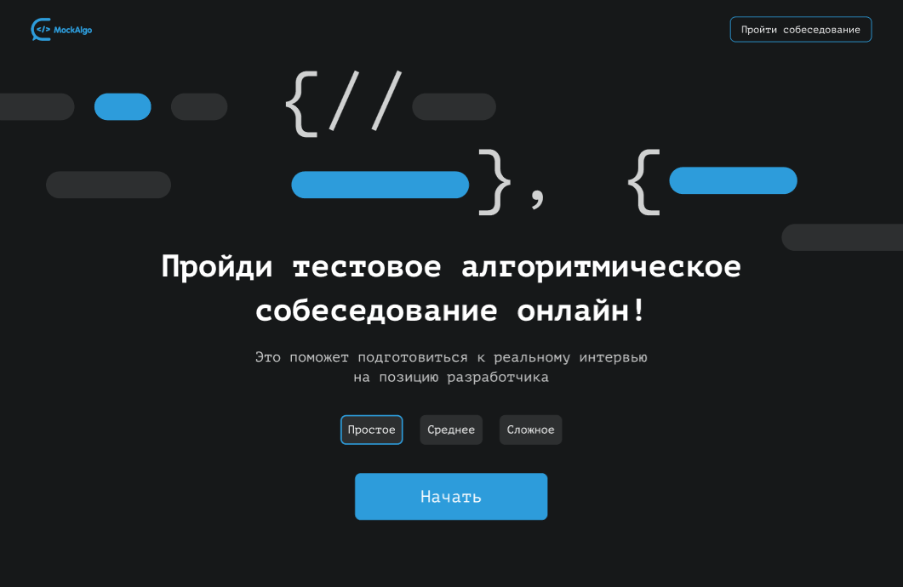
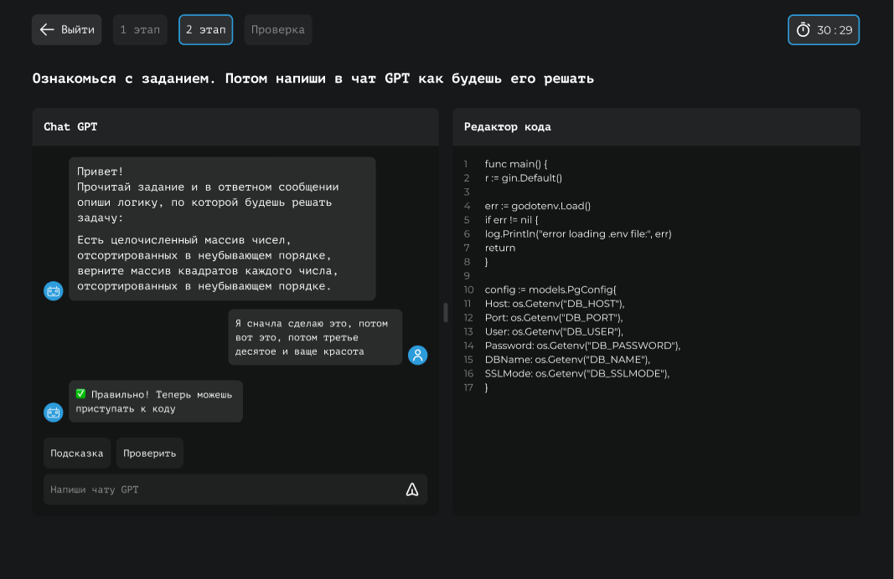

# Algo Mock

As part of the hackathon, my responsibility was to create a platform interface for conducting algorithmic interviews. Together with the backend developer, we effectively completed the task, developing a working prototype of the application in the shortest possible time.

Out of 80 participating teams, our team was among the 10 finalists.

## Personal results

- Interesting experience working in a team at all stages of product creation. The team included: backend developer, prompt engineer, designer and product manager;

- Effective work under tight deadlines;

- I successfully completed my duties, my colleagues gave me a positive assessment.

## Screenshots

